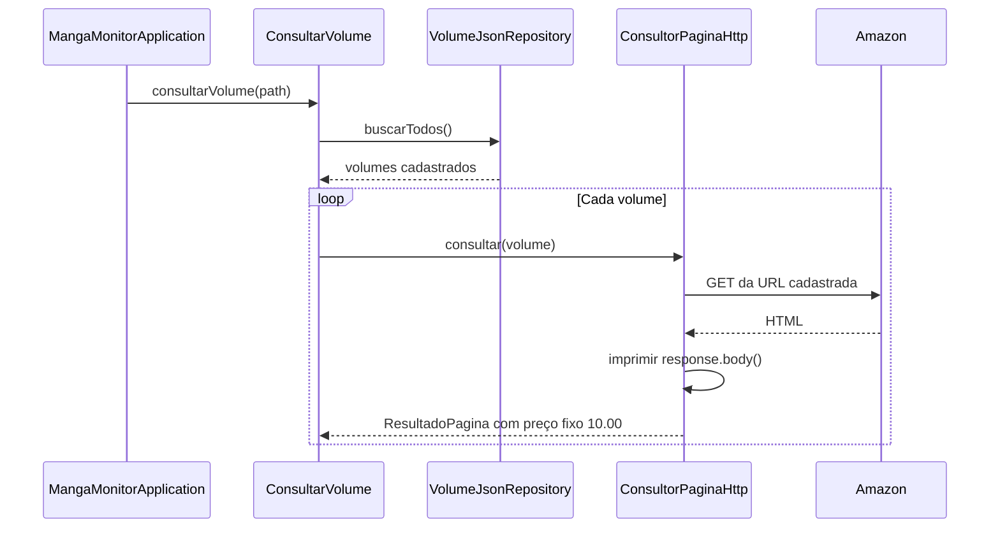

# Captura real da consulta Amazon — 01/10/2026

## Objetivo e execução

Executar o projeto existente, sem alterar código, e identificar o preço no HTML
impresso por `ConsultorPaginaHttp`. O aplicativo foi iniciado pelo Maven, com a
raiz do repositório como diretório de execução, e recebeu a opção 2 do menu.
Essa opção lê `Dados/volumes.json` e consulta os dois cadastros existentes.

## Fluxo observado

## Evidência e interpretação

- Título recebido: Fullmetal Alchemist - Especial - Vol. 20.
- ASIN: `8545706820`.
- Os cadastros dos volumes 20 e 21 usam esse mesmo ASIN; ambos retornaram o volume 20.
- O único elemento `.a-offscreen` de cada página contém `R$29,10`.
- Seu contexto é “Outros vendedores na Amazon”, com “Comparar outras 33 ofertas a partir de”.
- Seletor correspondente: `#aod-ingress-link .a-price .a-offscreen`.
- Esse valor representa o preço inicial das ofertas, sem identificar uma oferta
  específica, vendedor ou condição do exemplar. Não deve ser apresentado como
  preço confirmado da oferta principal ou total final da compra.
- Os contêineres de preço principal examinados não forneceram um preço;
  `.priceToPay` não apareceu nas duas respostas.
- A implementação ainda retorna `10.00` fixo e não extrai o preço do HTML.

## Artefatos da execução

- Log temporário: `/tmp/manga-monitor-consulta.log`.
- HTML da primeira consulta: `/tmp/manga-monitor-amazon-1.html`.
- HTML da segunda consulta: `/tmp/manga-monitor-amazon-2.html`.

Os arquivos em `/tmp` são temporários. Esta documentação preserva as conclusões.
O seletor foi identificado na estrutura capturada; não foi implementado nem
testado com Jsoup. Respostas futuras podem ter estrutura e preços diferentes.

## Verificação e próximo passo

A suíte completa `./mvnw test` compilou o projeto e encontrou 22 testes:
8 passaram, 2 terminaram com erro e 12 foram ignorados. Os erros são
`NullPointerException` nos testes `deveGravarPrimeiroVolumeNoArquivoJson` e
`deveAdicionarSegundoVolumeSemApagarOPrimeiro`, nas linhas 58 e 100 de
`VolumeJsonRepositoryTest`. Nenhuma correção foi feita nesta tarefa.

A execução do aplicativo terminou com `BUILD SUCCESS`. Houve um aviso de banco
H2 já fechado no encerramento, após a captura do HTML.

## Regra definida pelo usuário para a primeira versão

Considerar somente o preço da oferta principal, no bloco principal de compra
próximo ao frete. Não substituir esse preço pelo menor valor da página, por
parcelas ou por chamadas de outras ofertas “a partir de”. Essa decisão não
autoriza nem representa implementação da extração.

Na captura realizada, `#buybox` informa: “Para ver os detalhes do produto,
adicione este item ao seu carrinho. Você poderá removê-lo depois.” O bloco
identifica Leitura JK Shopping como responsável pelo envio e venda, mas não
expõe um preço legível nessa região. Nenhum item foi adicionado ao carrinho.
`#buybox-top-container` também contém chamadas “a partir de R$ 27,89”, que não
confirmam o preço da oferta principal e ficam excluídas pela regra definida.

Consequentemente, nesta resposta capturada, o preço principal não foi obtido.
A extração futura deve representar preço ausente, nunca zero nem o valor de
outras ofertas. A apresentação e a classificação desse caso ainda devem ser
definidas antes da implementação. Não inferir falta de estoque pela ausência
do preço.

Os testes futuros devem cobrir preço principal presente, ausência de preço,
múltiplos preços, parcelas e a distinção entre oferta principal e chamadas de
outras ofertas, mesmo quando estas ficam próximas ao bloco principal.
