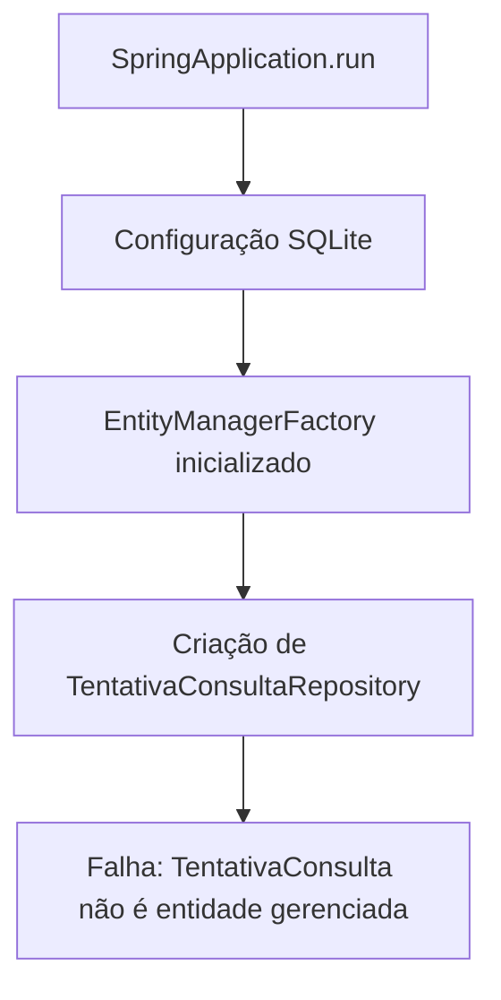
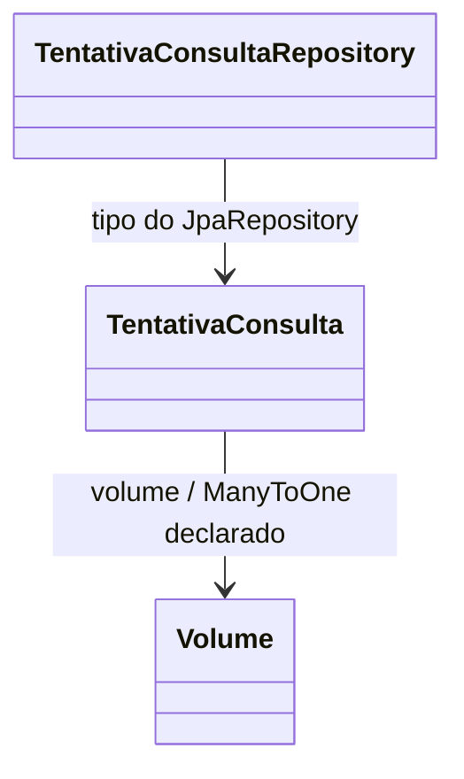

# Diagnóstico da inicialização — 2026-10-05

## Atualização após as correções do usuário

O usuário adicionou `@Entity` e construtores sem argumentos às duas entidades, além de remover `final` dos campos de `Volume`. Reexecutado o mesmo comando de teste descrito abaixo: o Hibernate reconheceu as entidades e criou `tentativa_consulta` e `volume` no SQLite em memória. O erro anterior foi superado.

O bloqueio atual, confirmado em execução, é:

```text
No property 'dataConsulta' found for type 'TentativaConsulta'
```

Origem: `TentativaConsultaRepository.findByVolumeIdOrderByDataConsultaDesc(Long volumeId)`. O atributo da entidade se chama `instante`, portanto a assinatura indicada é `List<TentativaConsulta> findByVolumeIdOrderByInstanteDesc(Long volumeId);`. Ela mantém o filtro por ID do volume e ordena pelo instante da consulta, do mais recente para o mais antigo.

Resultado da verificação: um teste executado, um erro. Não foi alterado código nesta revisão. A renomeação proposta ainda precisa ser aplicada e validada; não há confirmação de inicialização completa após ela. As seções seguintes preservam o diagnóstico inicial como histórico.

## Escopo e resultado

Investigação solicitada sobre a falha de execução, com referência a `application.properties`. Nenhum código ou configuração foi alterado. Existem alterações locais prévias do usuário.

O projeto compila, mas o teste existente `MangaMonitorApplicationTests.contextLoads` falha na criação do repositório JPA:

```text
Not a managed type: class com.example.Manga_Monitor.dominio.TentativaConsulta
```

## Reprodução

Na pasta `Manga-Monitor` que contém o `pom.xml`:

```sh
mvn -o -Dtest=MangaMonitorApplicationTests -Dspring.datasource.url=jdbc:sqlite::memory: test
```

O comando usa Maven offline, executa somente o teste de contexto e substitui a URL por SQLite em memória para preservar o banco local. Resultado: um teste executado, um erro. A conexão SQLite e a inicialização do EntityManagerFactory ocorreram antes da falha. Ambiente observado: Java 25.0.4.1, compilação com release 21, Spring Boot 4.1.1, Hibernate 7.4.5.Final.

## Causa confirmada e pontos relacionados

- `TentativaConsultaRepository` estende `JpaRepository<TentativaConsulta, Long>`, mas `TentativaConsulta` não possui `@Entity`. As anotações `@Id` e `@GeneratedValue` nos campos não a registram como entidade.
- `TentativaConsulta.volume` declara `@ManyToOne`, mas `Volume` também não possui `@Entity`.
- Ambas as classes só possuem construtores com parâmetros. A adequação ao modelo JPA deve contemplar construtores sem argumentos e os campos finais de `Volume`.
- `findByVolumeIdOrderByDataConsultaDesc` referencia `dataConsulta`, inexistente em `TentativaConsulta`; o atributo temporal atual é `instante`. É uma inconsistência estática adicional, ainda não alcançada no teste porque o contexto falha antes.

## Relações e fluxo observado





O menu de console é executado somente após `SpringApplication.run`; a falha impede chegar a ele. Os diagramas representam o código observado, não um mapeamento JPA funcional.

## Próxima etapa

Caso seja solicitada implementação, adequar o mapeamento das entidades e o método derivado do repositório; executar novamente o teste de contexto e verificar persistência e leitura. Não foi aplicada nem validada uma correção nesta investigação. O erro específico do console do usuário foi solicitado para comparação com a reprodução isolada.
