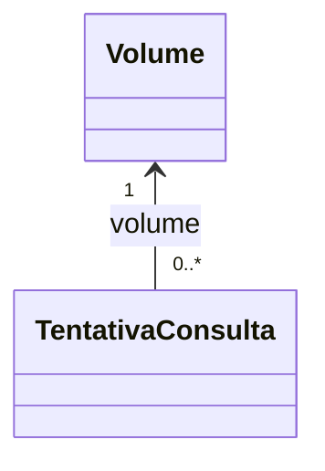

# Diagnóstico da persistência de tentativas

Data: 2026-10-07. Escopo: executar a aplicação e identificar o erro; nenhuma correção de código aplicada.

## Reprodução

Executado a partir da pasta interna `Manga-Monitor`:

```sh
./mvnw spring-boot:run -Dspring-boot.run.workingDirectory=/home/gmb/Documentos/Projetos/Manga-Monitor
```

O comando compila e inicia a aplicação, definindo a raiz externa como diretório de trabalho para localizar `Dados/volumes.json` e o SQLite. Foi necessário acesso de rede para a consulta HTTP. Log desta sessão: `/tmp/manga-monitor-diagnostico-rede.log` (temporário).

## Resultado observado

A inicialização e a conexão SQLite funcionam. A chamada `TentativaConsultaRepository.save` em `ConsultarVolume.java:43` lança `InvalidDataAccessApiUsageException`, causada por `TransientPropertyValueException`. O Hibernate identifica `TentativaConsulta.volume` como associação obrigatória a um `Volume` não persistido, de ID 0.

O fluxo lê volumes do JSON, cria uma tentativa com um desses objetos e tenta salvar somente a tentativa. Não existe nesse fluxo uma etapa de persistência ou recuperação do volume no SQLite.



O `ManyToOne` já expressa corretamente várias tentativas para um volume. Uma coleção `OneToMany` no volume não resolve a ausência de persistência do objeto referenciado.

## Direção da correção, ainda não implementada

Persistir ou localizar o volume no SQLite antes de salvar a tentativa e reutilizar sua identidade nas consultas seguintes. Definir como identificar um volume existente para evitar duplicações ao reler o JSON. Não atribuir um ID artificial para contornar a exceção.

Há também um apóstrofo excedente em `@JoinColumn(name = "volume_id'", nullable = false)`. Isso nomeia a coluna com o apóstrofo; não é a causa da exceção reproduzida. Uma correção desse nome deve considerar o esquema já existente.

## Ocorrências durante a reprodução

- Executar com diretório de trabalho na pasta interna falha com `NoSuchFileException` para o JSON e cria um SQLite separado nessa pasta pela configuração relativa e `ddl-auto=update`.
- No ambiente com rede restrita, a consulta HTTP falha e retorna null, levando a `NullPointerException` em `resultadoPagina.getPreco()`. Com acesso de rede, a execução alcançou a falha de persistência descrita acima.
- Maven imprimiu `BUILD SUCCESS`, apesar da exceção no fluxo `restartedMain`; esse texto não comprova sucesso funcional.
- A aplicação encerrou nas execuções observadas. Não foram implementadas correções nem executada a suíte de testes. Testes foram compilados pelo ciclo do comando Maven.

## Validação futura

Após correção autorizada, verificar que duas tentativas do mesmo volume ficam associadas ao mesmo registro SQLite, que a releitura do JSON não duplica o volume e que falhas HTTP têm tratamento explícito sem desreferenciar null.
