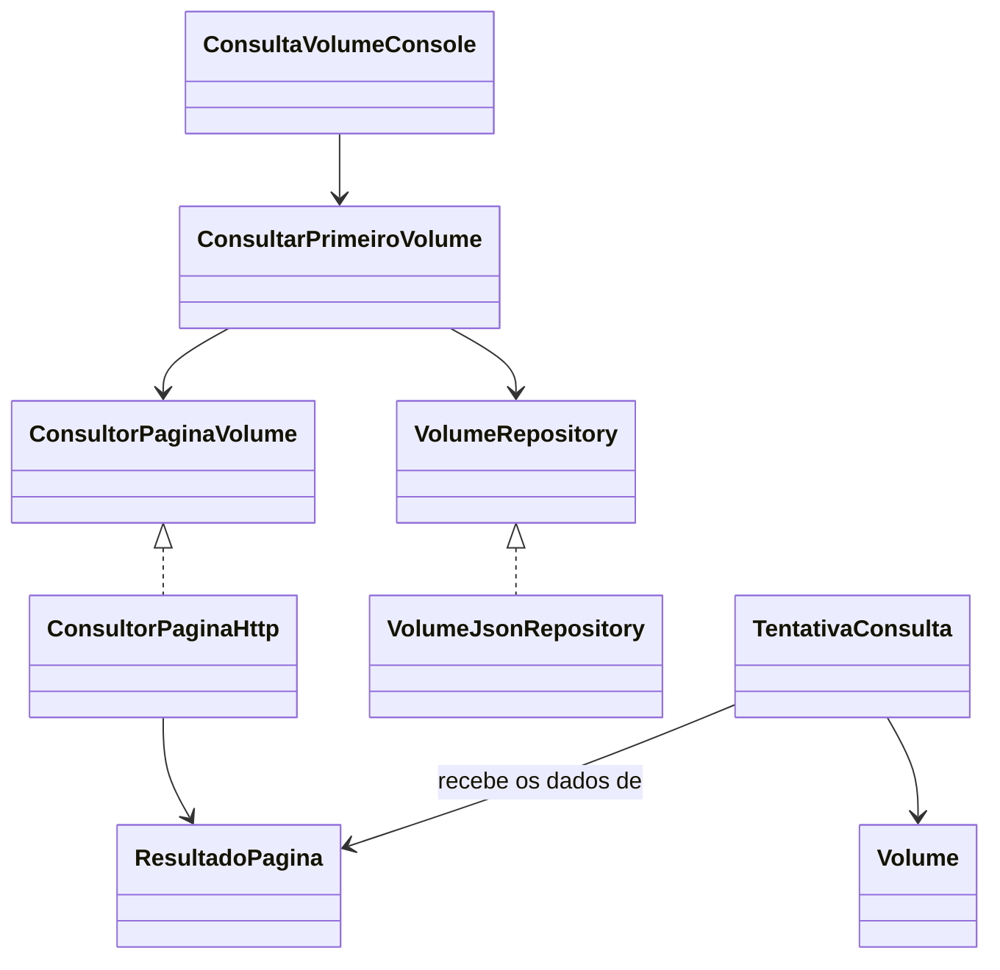

# Consulta HTTP do primeiro volume

## Objetivo e limite atual

Ler somente o primeiro volume de `Dados/volumes.json`, fazer uma requisição
HTTP à URL cadastrada e preparar a obtenção de preço e disponibilidade. Nesta
etapa não há agendamento, vários volumes, histórico persistente nem suporte a
várias lojas.

Os arquivos criados são esqueletos de aprendizagem. Métodos com
`UnsupportedOperationException` ainda não representam funcionalidade pronta.

## Relações entre entidades e componentes

- `Volume`: cadastro que informa título, número e URL.
- `ResultadoPagina`: preço e disponibilidade extraídos de uma resposta HTML.
- `TentativaConsulta`: registro completo do que aconteceu, incluindo instante,
  sucesso ou falha e motivo do erro.
- Um `Volume` poderá possuir várias `TentativaConsulta`; nesta etapa será criada
  somente uma tentativa para o primeiro volume.



## Caso de uso: consultar primeiro volume

1. O console solicita uma consulta ao caso de uso.
2. O caso de uso pede o primeiro cadastro a `VolumeRepository`.
3. `VolumeJsonRepository` lê o primeiro objeto do array JSON.
4. O caso de uso entrega o `Volume` a `ConsultorPaginaVolume`.
5. `ConsultorPaginaHttp` faz o GET e recebe o HTML.
6. O adaptador extrai disponibilidade e preço em `ResultadoPagina`.
7. O caso de uso cria `TentativaConsulta` com o instante atual.
8. O console apresenta sucesso, indisponibilidade ou falha técnica.

Falha HTTP não significa produto indisponível. Em timeout, a disponibilidade é
`DESCONHECIDA`, o preço fica ausente e o motivo da falha deve ser registrado.

## Tela inicial de console

```text
########## Consultando Volume ##########
Título: Fullmetal Alchemist
Volume: 19
Disponibilidade: DISPONIVEL
Preço: R$ 39,90
Consultado em: 22/09/2026 10:30
```

Para indisponibilidade, exibir `Preço: não informado`. Para erro, exibir o
motivo técnico em linguagem compreensível sem despejar a stack trace ao usuário.

## Manual de implementação incremental

1. Implemente e teste `VolumeJsonRepository.buscarPrimeiro()`.
2. Implemente `ResultadoPagina` e seus testes de validação.
3. Implemente e teste a extração usando arquivos HTML locais.
4. Implemente o transporte HTTP com timeout e servidor falso nos testes.
5. Implemente e teste `ConsultarVolume` com dependências falsas.
6. Implemente `ConsultaVolumeConsole`.
7. Monte as dependências em `MangaMonitorApplication`.
8. Somente então faça um teste manual com a URL real.

Ao implementar, habilite um teste por vez. O ciclo esperado é: teste falha,
implementar o mínimo, teste passa e refatorar. Não use a rede externa nos testes
automatizados porque isso os tornaria lentos e instáveis.

## Cenários esperados

| Cenário | Sucesso | Disponibilidade | Preço | Motivo de erro |
|---|---:|---|---|---|
| Página informa R$ 39,90 | sim | DISPONIVEL | 39.90 | ausente |
| Página informa sem estoque | sim | INDISPONIVEL | ausente | ausente |
| Requisição expira | não | DESCONHECIDA | ausente | timeout |

## Observações sobre a Amazon

O HTML pode mudar conforme localização, cookies, testes da loja e mecanismos
antibot. A extração deve ficar concentrada no adaptador HTTP. Assim, mudanças
nos seletores não contaminam o domínio, o caso de uso ou a apresentação.
